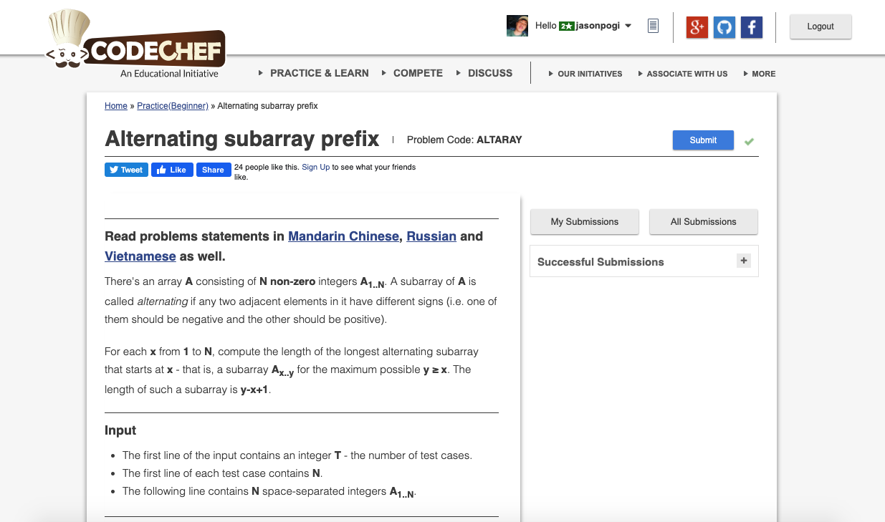

# Codechef-Alternating-Subarray-Prefix
### Problem

### Program Simulation
<pre>
  Sample Input: 1 2 3 4

  l[3] = 1

  *start at index 2
  if(3 * 1LL * 4 < 0) // omitted
  else
  l[2] = 1

  if(2 * 1LL * 3 < 0) // omitted
  l[1] = 1

  if(1 * 1LL * 2 < 0) // not omitted
  l[0] = 1

  iterate through the values of l array, and print it

  Final Output: 
  1 1 1 1
  

  Sample Input: 1 -5 1 -5

  l[3] = 1

  *starting at index 2
  if(1 * 1LL * -5 < 0) // not omitted
  l[2] = 1 + 1 // 2
  l[2] = 2

  if(-5 * 1LL * 1 < 0) // not omitted
  l[1] = 2 + 1 / /3
  l[1] = 3

  if(1 * 1LL * -5 < 0) // not omitted
  l[0] = 3 + 1 // 4
  l[0] = 4

  iterate through the values of l array, and print it

  Final Output:
  4 3 2 1
  

  Sample Input: -5 -1 -1 2 -2 -3

  l[5] = 1

  *start at index 4
  if(-2 * 1LL * -3 < 0) // omitted
  else
  l[4] = 1

  if(2 * 1LL * -2 < 0) // not omitted
  l[3] = 1 + 1 // 2
  l[3] = 2

  if(-1 * 1LL * 2  < 0) // not omitted
  l[2] = 2 + 1 // 3
  l[2] = 3

  if(-1 * 1LL * -1 < 0) // omitted
  else
  l[1] = 1

  if(-5 * 1LL * -1 < 0) // not omitted
  else
  l[0] = 1

  iterate through all the values in l array, and print it

  Final Output:
  1 1 3 2 1 1
 </pre>

  
